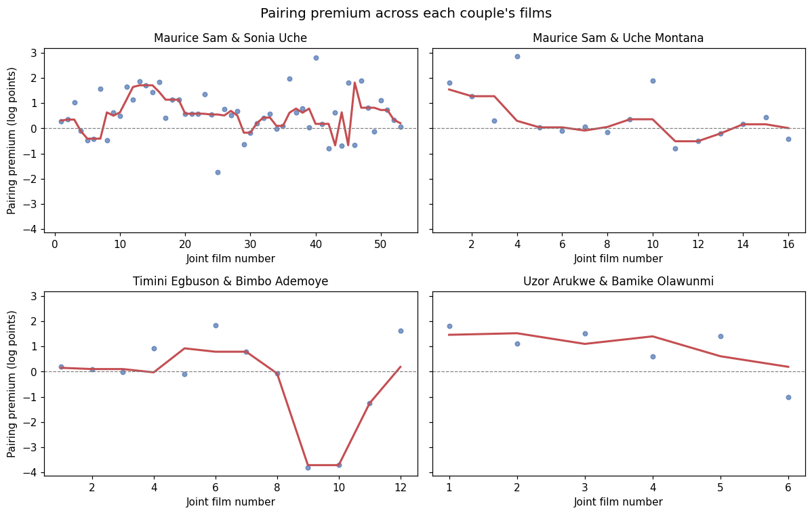
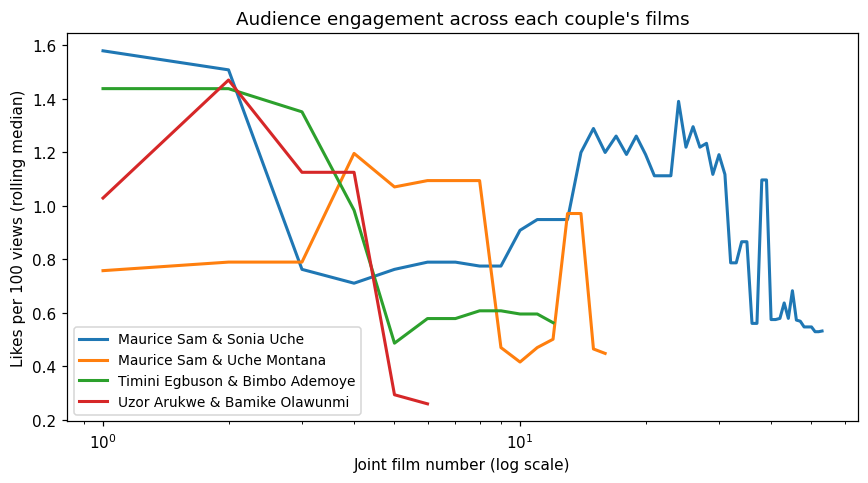

# Do Audiences Tire of Nollywood's Screen Couples?

**A case study of audience fatigue in four recurring romantic pairings, using YouTube data**

Author: Irene Undiandeye

## Overview

Nollywood now releases many of its films in full on YouTube, on actor- and producer-owned channels that reach audiences in Nigeria and the diaspora. This makes view counts a meaningful measure of audience demand. Films are often marketed around the chemistry of an established on-screen couple, and some pairings star together dozens of times. This project asks whether audiences tire of a couple as they make more films together, and whether any decline can be seen in the data before it shows up in views.

The case study follows four of the most prominent YouTube-era couples: Maurice Sam and Sonia Uche, Maurice Sam and Uche Montana, Timini Egbuson and Bimbo Ademoye, and Uzor Arukwe and Bamike "BamBam" Olawunmi.

## Data

All data comes from the YouTube Data API v3, collected on 6 October 2026. A first collection searched YouTube for full-length films featuring each of twelve candidate couples. A second collection downloaded the complete upload history of 22 official producer and actor channels, about 11,800 videos, so that each actor's films with and without their usual partner could be identified. The analysis keeps only full-length single films, combines multi-part uploads, excludes mass re-upload channels and dubbed versions, merges re-uploads of the same film, and counts an actor only when they are billed in the title or the opening of the description. The final case-study dataset contains 87 joint films across the four couples, within a wider set of 1,739 films used to estimate expected views.

## Method

The central measure is the **pairing premium**: the difference, in log points, between a film's actual views and the views expected from the releasing channel, the film's age, its release year and each actor's individual drawing power, estimated with a regression across all 1,739 films. A premium of +0.5 means about 65% more views than expected. The analysis then traces each couple's premium across their films, estimates mixed-effects models with a random intercept per couple to test whether the premium declines with the number of collaborations and whether short gaps between films accelerate any decline, and tests whether audience engagement, measured as likes per view, falls before views do.

## Key Findings

There is no single fatigue curve. Maurice Sam and Uche Montana's premium declined significantly after a very strong start, from films that far outperformed expectations to recent ones that barely exceed them. Maurice Sam and Sonia Uche, by contrast, have sustained a premium of roughly 80% above expectations across 53 films with no sign of decline. The two newer couples peaked within their first five films, but with 12 and 6 films their trends are too uncertain to confirm. Pooled across couples, the decline is modest and not statistically significant, and the gap between films has no clear effect.

The most consistent finding concerns engagement. Likes per view fall significantly as couples make more films together (p ≈ 0.002), including for Maurice Sam and Sonia Uche, whose view premium holds steady. Enthusiasm appears to cool before viewership does, which makes engagement a plausible early-warning signal of audience fatigue.

## Limitations

Views are a single snapshot, so the age control approximates rather than measures each film's launch performance, and subscriber counts reflect channels today rather than at release. Billing is inferred from titles and descriptions, and some re-uploads may remain despite deduplication. With four couples, the findings describe these pairings rather than Nollywood as a whole, and the association between collaborations and engagement is descriptive rather than causal.

## Repository Structure

`config/` holds the couples, the official channels and a small set of manual cast corrections. `src/collect_youtube.py` and `src/collect_channels.py` collect the data, and `src/build_dataset.py` builds the case-study dataset and the pairing premium. `notebooks/01_audience_fatigue_analysis.ipynb` contains the analysis, and `data/processed/` holds the processed datasets. Raw API responses are kept locally and excluded from the repository.

## How to Reproduce

Install the dependencies with `pip install -r requirements.txt`, create a `.env` file containing `YOUTUBE_API_KEY=...` (see `.env.example`), then run `python src/collect_youtube.py`, `python src/collect_channels.py` and `python src/build_dataset.py`, and open the notebook. View counts change daily, so a new collection will give slightly different numbers.

## Tools

Python, the YouTube Data API v3, pandas, statsmodels (OLS and mixed-effects models), Matplotlib and Jupyter.
